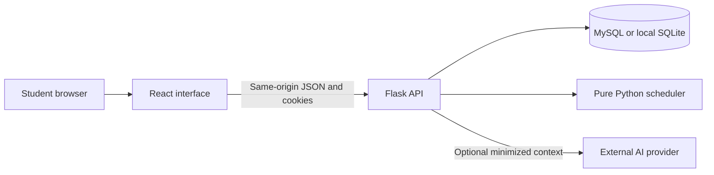
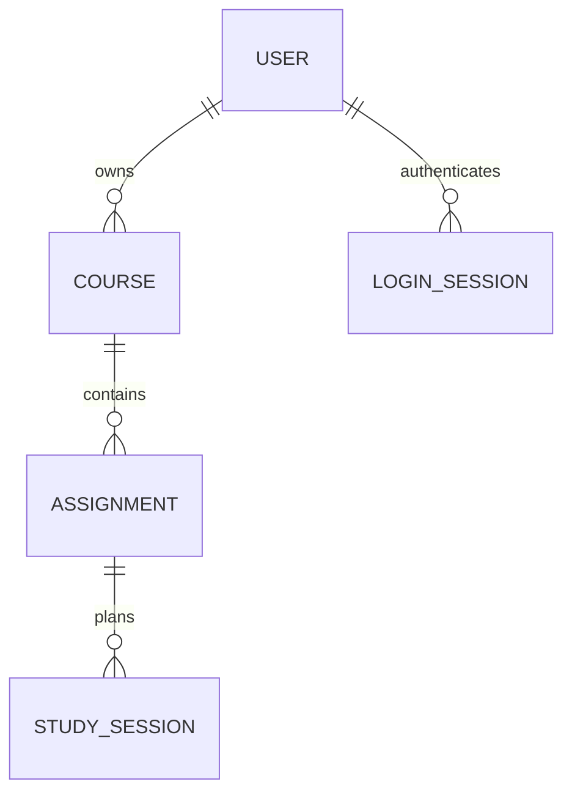

# StudyFlow implementation decisions

Date: September 10, 2026. These are implementation decisions made under the user's explicit permission to adjust requirements. They are proposed wording for the group's final report, not a claim of instructor or team approval. Original documents have not been modified.

## Source baseline

The supplied ZIP contains the proposal PDF and a presentation, not application source. Implementation uses the proposal for intent, SRS v2.0 for Release 1 requirements, and the September 9 QA/testing plan v1.1 for detailed fixtures and verification. The older August 24 SQAP-STP PDF is supporting context. Broader AI scheduling in the proposal is superseded by the rule-based planner in the revised SRS.

## Architecture

User → Course → Assignment → StudySession ownership is enforced on the server. MySQL foreign keys use cascade deletion, with matching SQLite foreign-key enforcement. Schema creation is through Alembic, never `create_all` at startup. The database holds only hashed session tokens; the raw token lives in an HttpOnly cookie. Accepted breakdowns are a JSON list on the assignment.

## ADR 001 Local database option

Retain React, Flask and MySQL. Add SQLite for local demonstrations, unit tests and development without a database server. Both use SQLAlchemy and the same migration. No SQLite result is presented as MySQL evidence. This is an extension to DC-02, not removal of MySQL support.

Report wording: “StudyFlow uses React and Flask with SQLAlchemy persistence. MySQL is the deployment database, while SQLite is supported for local development and demonstrations.”

## ADR 002 Scheduling oracle and capacity

The pure scheduler now sorts incomplete overdue work before incomplete upcoming work. Within each group it sorts by earliest due timestamp, then High/Medium/Low priority, then ascending stable assignment ID. This retains the original QA plan F2 order when no assignments are overdue. Split allocations into contiguous sessions of at most 30 minutes, including a final partial minute count. F2 produces A1 2×30, A2 1×30, A3 3×30; A4 is completed and excluded.

The student chooses an earliest daily starting hour (00:00–20:00), a later ending hour (01:00–24:00; default 22:00), a total budget of 30–240 study minutes per local day, and a 1–90 day horizon (the UI offers common presets). Every calendar day, including weekends, offers candidate slots from that start until the selected end time. Busy periods are skipped without consuming study budget. Default: 09:00–22:00, 180 minutes, 30 days. Preserved pending/completed study consumes the budget on each local date it overlaps, including earlier today and before the selected start; missed sessions consume no budget. Generation, fill, conflict repair and compensation all pass retained study separately from personal exclusions. Existing sessions and explicit manual anchors are preserved even when they already exceed a newly selected budget; automatic allocation adds no more study on such days. Capacity is charged only when a minute is allocated, so assignment earliest starts do not discard usable earlier time for other work. The browser supplies its IANA timezone; local-day boundaries follow daylight-saving changes while the database stores UTC. Only future whole-minute slots are eligible and new sessions split at local midnight. Sessions for work not yet overdue must end at or before the deadline. Overdue work may use future slots within the planning horizon. A deadline equal to now is not yet overdue, but has no future planning capacity.

Work that cannot fit is returned and displayed as unallocated minutes. Overdue assignments can be scheduled without changing their original deadlines and retain their overdue label until completed or their deadline is revised. Upcoming assignments still cannot be scheduled past their deadlines. The scheduling horizon remains bounded.

## ADR 003 Regeneration and history

Regeneration atomically replaces sessions starting at or after the current time, including manually edited future sessions. Confirmation in the UI makes this explicit. Sessions already started are retained and reserve any still-active minutes. Completed sessions count as self-reported study; pending sessions reserve planned work until confirmed, while missed sessions contribute zero credited minutes. Elapsed time alone never proves study took place.

This keeps repeated regeneration from allocating the same work twice. Reducing an assignment estimate trims surplus minutes from its latest future sessions in the same transaction, preserving started history and other assignments. Increasing estimates, changing priorities or changing deadlines does not rebuild the calendar. Students can choose Schedule remaining to credit and preserve every existing session and allocate only deficits into free slots. This operation retains session IDs, times and durations, uses the same scheduling constraints and reports shortfalls; existing busy conflicts require the separate repair action. Full regeneration remains available with confirmation. MySQL mutations lock the owner row, and SQLite mutations acquire an immediate transaction, so concurrent requests cannot create duplicate future allocations. Only full generation and explicit session compensation/repair may replace existing plan IDs.

## ADR 004 Session adjustment and progress

Schedule uses a viewport-sized layout with a compact planning toolbar and an internally scrolling calendar. Plan settings use a draft dialog: Cancel discards edits; Apply settings validates and persists them via an owner-scoped, CSRF-protected endpoint and checks future sessions without moving any. Checks use the selected timezone and daily boundaries for study hours, daily quota, planning horizon and busy-time overlap. Daily usage merges pending/completed intervals including earlier study that day; missed sessions consume no quota. Started sessions are preserved and never offered for regeneration. Conflicts open an explicit regeneration choice with reasons; Keep current plan or Escape leaves sessions intact and the new settings saved. The toolbar summarizes pending check-ins, busy-time conflicts and remaining work. Details and personal-arrangement management open independently scrolling side dialogs, so long histories cannot push the calendar out of the first screen. Shared dialogs use unique accessible headings and handle nested Escape/Tab without closing their parent. The active planning timezone appears in the settings summary; calendar dates continue to display in the browser timezone.

Ended sessions have an explicit student check-in: completed or not completed, with correction supported. All existing rows migrate to pending without inferring past completion. Confirmed completion records study minutes and moves Not Started to In Progress; students retain the final assignment completion decision. Missed history stays visible, but its minutes become eligible for additive scheduling. Correcting missed to completed trims newly redundant future allocations in the same transaction. All planner/trim paths share the credited-minutes rule. A dashboard prompt and Schedule check-in queue surface pending ended sessions; reviewed outcomes remain accessible in history and the calendar. Progress reports confirmed study separately from assignment completion. Local timers refresh the session-ended display every 15 seconds and on window focus; the server enforces the actual end-time boundary.

Students can edit a future session to 1–240 minutes or delete it. Busy time and earlier preserved sessions cannot be overlapped, but later study sessions can move to accommodate the edit. The edited anchor must end before the deadline unless that deadline has already passed. Manual anchors may depart from the generation availability window. Elapsed or active sessions are not editable. Changing a session does not change the assignment estimate.

Session edits/deletions now trigger atomic downstream compensation: keep the anchor and earlier sessions, count their minutes against assignment estimates, remove later affected sessions, and replan the remainder at or after the later of the original and new end. This leaves released time free during this operation, instead of immediately recreating a deleted or shortened slot. The existing scheduler enforces busy-time, earliest-start, horizon, deadline and overdue-priority rules. Unrelated backlog is not added. A nullable per-user JSON field stores the last generated planning settings; an additive migration leaves existing data intact. Both the edit and replan roll back together if persistence fails. Valid edits with insufficient capacity remain saved and explicitly report the shortfall.

All three status values are supported, including reopening completed work. Completing an assignment saves status and deletes future sessions in one transaction. Elapsed/active history remains; repeated completion is safe. After reopening, Schedule remaining or full regeneration can arrange the unallocated work.

## ADR 005 Validation and deletion

Emails are trimmed and lowercased for uniqueness. Names have 1–80 characters, course names 1–120, course codes 0–30, titles 1–200, notes 0–4000. Passwords have 10–128 characters; spaces are preserved. Estimates are integers from 1–10080 minutes. Dates require explicit timezones and years 2000–2100; past assignment deadlines are allowed to represent overdue work. Unknown JSON fields are rejected. Mutations validate all submitted fields before saving anything.

Confirmed course deletion cascades to assignments, accepted breakdowns and all sessions. Confirmed assignment deletion removes its breakdown and sessions. Cancellation performs no request. Foreign record IDs return 404, avoiding record-disclosure differences between missing and foreign data.

## ADR 006 Security and deployment boundary

Password hashing uses Werkzeug scrypt. Sessions have 256-bit random opaque tokens, stored as SHA-256 hashes; authenticated sessions expire after 12 hours and anonymous form sessions after one hour. Registration and login rotate the session; logout deletes it server-side. CSRF tokens are separate unpredictable values tied to the session, sent in `X-CSRF-Token`. The UI keeps the CSRF token in memory, never the authentication cookie. Every state-changing API request, including login and registration, requires valid CSRF protection. Origin is checked when supplied.

Both email and source-IP rolling failure buckets trigger limiting after five failed logins within 15 minutes. The lock lasts at least 15 minutes from the triggering failure; correct credentials do not bypass it. Valid login does not erase recent failures. Buckets persist across service restarts and are locked for concurrent updates. Raw IP/email identifiers in these buckets are hashed.

Production cookies add Secure; local HTTP cookies retain HttpOnly and SameSite=Lax. The production setup requires an HTTPS public origin and exactly one trusted reverse proxy. Only Caddy exposes host ports. ProxyFix trusts one forwarded protocol and address hop, while Caddy overwrites those values. Do not expose the production Flask port directly. Caddy redirects HTTP and only allows TLS 1.2/1.3. The app sets CSP, no-sniff, frame denial, no-store for APIs, and HSTS in production. Deployment protocol behavior still needs live verification.

Authenticated password changes require the current password and matching new-password confirmation. New passwords follow the existing 10–128-character rule and must differ from the current password. Incorrect current-password attempts share the existing email/IP throttling buckets. The account is locked and its session rechecked before verification. Password rehashing, revocation of other account sessions, and replacement of the current session/CSRF token commit together; failures roll back. The sidebar provides a Change password dialog on desktop and mobile. Password recovery remains outside scope.

## ADR 007 Optional AI

Live AI is disabled until both a server-side key and model are configured. Empty Notes are rejected before provider invocation and request throttling. The adapter calls the Responses API once with structured output, provider storage disabled, no tools, and a planning-only prompt. The outbound context allowlist contains title, Notes, estimated minutes and priority. Account data and credentials are never placed in model input. The request UI explains that title and Notes are sent. Both fields are treated as untrusted assignment data in the prompt.

The model first assesses whether Notes and title describe enough concrete work to form a task breakdown, without imposing a character-count threshold or inventing requirements. The structured result contains `status`, `message` and `steps`: `needs_details` must have a nonempty clarification and no steps; `ready` must have valid steps and no clarification. Contradictory/malformed responses fail safely. Insufficient details return HTTP 422 with a Notes field reminder; the UI offers Edit notes and no acceptance action. Valid suggestions retain the existing transient review/accept flow. Existing accepted steps are preserved on clarification and errors. Semantic assessment remains model-dependent.

Provider responses must contain 1–12 nonempty plain-text steps, each at most 500 characters. Markup is rejected. Connection/read timeouts are 3/7 seconds with no application retries. These are transport timeouts, not a strict ten-second wall-clock service guarantee. The group should use this wording instead of treating the QA plan's proposed ten seconds as an exact total deadline.

Suggestions remain transient browser state until accepted; dismiss/refresh saves nothing. Acceptance replaces the assignment's breakdown, making repeat acceptance idempotent. It never changes the authoritative schedule. There is a ten-second request cooldown per session. Provider faults return a safe message and leave core functions available. No live model quality claim is made from stubs.

## UI and scope

Study-session dialogs share an assignment information card for future edits, active sessions and ended-session check-in. The card uses the loaded owner-scoped assignment and schedule data; study totals reuse the same calculation as Assignments. It displays course, deadline, priority, status, estimated/remaining study, unallocated and awaiting-confirmation minutes, Notes and an expandable accepted breakdown. Notes remain escaped React text with preserved line breaks and bounded scrolling. Opening a session does not update the assignment or schedule. Session editing and outcome actions remain separate beneath the information card.

Progress derives daily study history from the existing owner-scoped schedule response. Only completed sessions that have ended are counted, split by overlap with browser-local calendar dates using elapsed milliseconds. The 7-day range includes today and six previous dates; the 30-day range includes today and 29 previous dates, grouped into clipped Monday–Sunday weeks. Empty buckets remain visible. The chart supplies accessible bar buttons, keyboard details, range totals and adaptive axis steps. It requires no new persistence or API endpoint.

The calendar measures its scroll viewport minus the sticky date header and divides this space by the selected visible hours (6, 12 or 24; default 12). Event geometry, hour labels and half-hour click targets share this scale. Changing view, week or viewport size resets the starting position to 08:00 (00:00 in the full-day view). Browser scroll anchoring is disabled in this container. The Schedule parent owns view selection so plan refreshes preserve it. Minimum event heights and collision lanes remain active at all scales.

### Personal busy time (approved scope extension)

BusyTime belongs directly to User and stores either an absolute UTC interval or a weekly rule (weekdays, local clock times, IANA timezone). Names are optional. Repeating overnight rules belong to their starting weekday. Availability expands rules only over the relevant planning or session interval, merges overlapping exclusions, and checks full-minute overlap before creating study slots. Busy periods reduce available clock time before the selected end but do not consume the daily study budget. They never override an assignment's earliest start or bypass a deadline that has not yet passed.

Saving busy rules leaves sessions unchanged and exposes future and active conflicts in the schedule response. The student can explicitly repair only future conflicts. Repair preserves other sessions and credits their minutes, reallocates only displaced work, and reports insufficient capacity. Started sessions remain history; manual edits cannot move sessions into busy time. All owner-scoped mutations share the scheduling transaction lock. The additive BusyTime migration leaves existing project data intact.

Report wording: “Students can define one-time or weekly unavailable periods. StudyFlow avoids these periods when generating or editing study sessions, identifies clashes with existing sessions, and can reschedule only conflicting future sessions while preserving the rest of the plan.”

### Assignment start preference (approved scope extension)

Each assignment has an earliest-start choice: 1 hour later (default), One week before deadline, or Custom date. The first retains the stored/API value `now` for compatibility but computes a new allocation bound of request time plus one hour for generation, fill, repair and compensation. Existing retained sessions do not move merely because time passes; a duration-only edit can preserve its start. A manually moved start must respect the current one-hour bound. The relative option derives its bound from the current deadline minus seven days (168 hours), so deadline edits update the bound. The custom date represents midnight in the timezone used when the student selects it and is persisted as UTC. For work not yet overdue it may equal the deadline date but cannot start after the deadline timestamp. Overdue work may choose a later custom date. Past custom/relative bounds are effectively clamped to now by the planner's future-slot filter.

The scheduler retains deadline/priority/ID ordering, but skips slots before each assignment's bound without consuming them; other assignments can use those earlier slots. Shortfalls remain unallocated and never override the student's start choice. When switching to the one-hour choice, or changing a custom/relative bound, conflicting future sessions of that assignment are removed atomically and become unallocated until filling remaining work or regeneration. Started history remains credited. The one-hour change requires no migration because the stored mode value is unchanged; existing plans remain until an explicit scheduling/edit action.

Report wording: “Students can choose a one-hour buffer for newly planned work, one week before the deadline, or a custom date. Automatic scheduling respects these choices and reports work that cannot fit within the applicable time constraints.”

The interface uses a persistent desktop sidebar and a collapsible mobile sidebar rather than the proposed top navigation. All specified destinations remain accessible. The weekly calendar now uses a 24-hour time grid with sticky date headers and a fixed left time axis; phones scroll the grid horizontally. Study and personal events are positioned by local clock time, split across midnight and assigned separate lanes when they overlap. Minimum event heights keep short sessions clickable, with precise durations in the editor. Empty half-hour slots use roving keyboard focus and open a prefilled personal-event editor. Personal events share BusyTime persistence and conflict handling; recurrence expansion is performed on the server using the scheduler's timezone logic. Native dialogs have explicit keyboard focus wrapping and Escape support, and hidden mobile navigation is inert.

Release 1 continues to exclude LMS sync, instructor/admin roles, collaboration, native mobile apps, offline support, notifications, password recovery and AI completion of academic work. No unrequested external account integration or public deployment has been performed.
